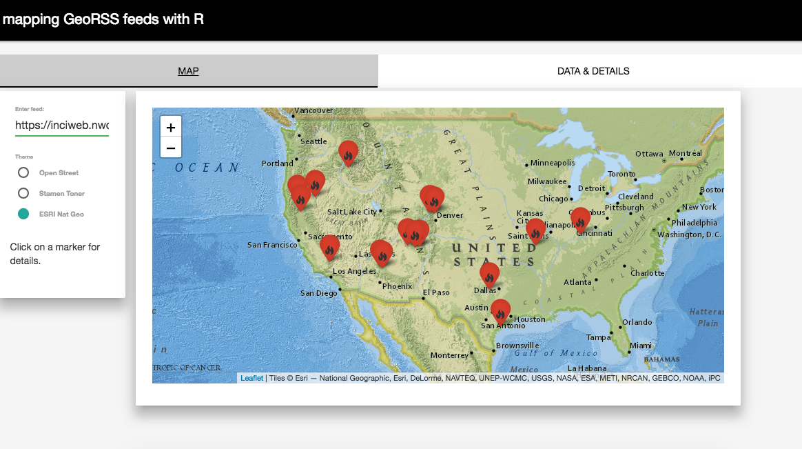

<!-- README.md is generated from README.Rmd. Please edit that file -->

# shinyGeoRSS

This is a [Shiny](https://shiny.rstudio.com) App for mapping geoRSS
feeds, using the [tidyRSS](https://github.com/RobertMyles/tidyRSS) and tidygeoRSS packages, along with [leaflet](https://rstudio.github.io/leaflet/),
[shinyMaterial](https://ericrayanderson.github.io/shinymaterial/),
[DT](https://shiny.rstudio.com/articles/datatables.html) and Shiny &
htmltools.

I made this to show the potential of parsing geoRSS feeds using tidyRSS & tidygeoRSS,
since these feeds naturally lend themselves to mapping, and with their
streaming-like quality, could make excellent data inputs for a variety
of apps.

## Usage

To see the app, just install the package:

``` r
# install.packages("devtools")
devtools::install_github("RobertMyles/shinyGeoRSS")
```

…and then use `library(shinyGeoRSS)` and the function `runApp()`. It
looks better in a browser such as Chrome or Firefox.

Here’s an example with live wildfire data, from
<https://inciweb.nwcg.gov/feeds/rss/incidents>:


